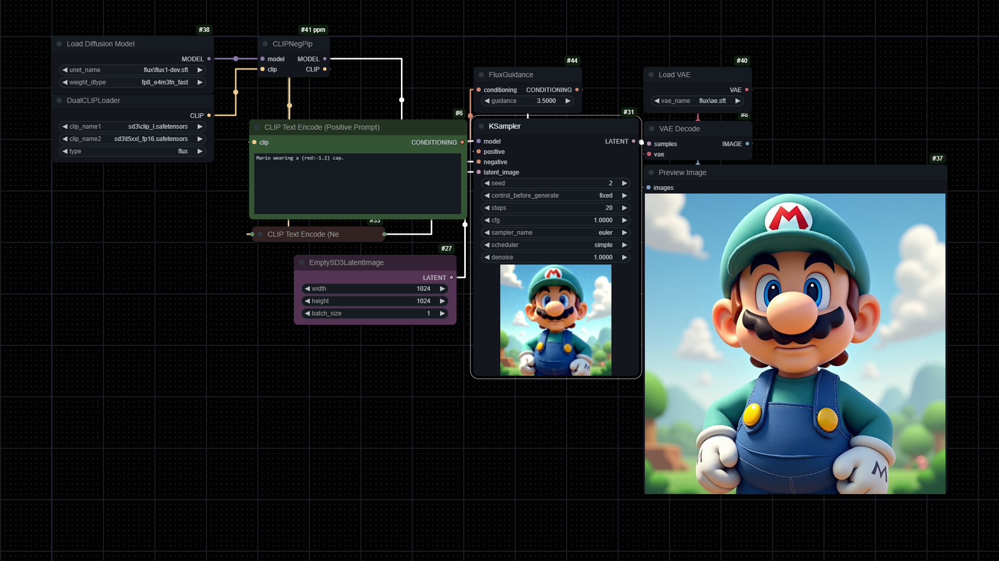

# ComfyUI-ppm
Just a bunch of random nodes modified/fixed/created by me or others. If any node starts throwing errors after an update - try to delete and re-add the node.

You can drag-and-drop workflow images from `examples/` into your ComfyUI. I'll probably add some more examples in future (but I'm kinda lazy, kek).

# Nodes

## CLIPNegPip

Supports:
- SD1 - SDXL
- FLUX
- HunyuanVideo (untested)

Modified implementation of NegPiP by [laksjdjf](https://github.com/laksjdjf) and [hako-mikan](https://github.com/hako-mikan). It uses ModelPatcher instead of monkey-patching, which should increase compatibility with other nodes.

`CLIPNegPip` node allows you to use negative weights in prompts. Connect the node before other model/clip patches.

Read more about NegPiP [in the original repo](https://github.com/hako-mikan/sd-webui-negpip). I recommend to keep all dots/commas inside weight braces (i.e. `(worst quality,:-1.3) (sketch:-1.1,)` instead of `(worst quality:-1.3), (sketch:-1.1),`).

> [!NOTE]
> `CLIPNegPip` is compatible with:
> - [Advanced CLIP Text Encode extension by BlenderNeko](https://github.com/BlenderNeko/ComfyUI_ADV_CLIP_emb)
> - [ComfyUI prompt control by asagi4](https://github.com/asagi4/comfyui-prompt-control/)
>
> `CLIPNegPip` is **incompatible** with:
> - [smZ Nodes by shiimizu](https://github.com/shiimizu/ComfyUI_smZNodes) (for now you can use ComfyUI_ADV_CLIP_emb and comfyui-prompt-control instead)
> - [Comfyui_Flux_Style_Adjust by yichengup](https://github.com/yichengup/Comfyui_Flux_Style_Adjust) (and probably some other custom nodes that modify cond tensors)

### Example workflow (FLUX)

## AttentionCouplePPM
Modified implementation of AttentionCouple by [laksjdjf](https://github.com/laksjdjf) and [Haoming02](https://github.com/Haoming02). I made `AttentionCouplePPM` node compatible with `CLIPNegPiP` node and with default `PatchModelAddDownscale (Kohya Deep Shrink)` node.

Inputs for new regions are managed automatically: when you attach cond/mask of a region to the node, a new `cond_` / `mask_` input appears. Last `cond_` / `mask_` inputs are always optional.

Use multiple `LatentToMaskBB` nodes to set bounding box masks for `AttentionCouplePPM`. The parameters are relative to your initial latent: `x=0.5, y=0.0, w=0.5, h=1.0` will produce a mask covering right half of your image.

## DynSamplerSelect
Modified samplers from [Euler-Smea-Dyn-Sampler by Koishi-Star](https://github.com/Koishi-Star/Euler-Smea-Dyn-Sampler).

Contains some new samplers: `euler_ancestral_dy`, `dpmpp_2m_dy` and `dpmpp_3m_dy`.

Tweaking `s_dy_pow` may reduce blur artifacts (optimal value is `2` for `euler_*` samplers and `-1` for `dpmpp_*` samplers, use `-1` to disable this feature).

## CFG++SamplerSelect
Samplers adapted to [CFG++: Manifold-constrained Classifier Free Guidance for Diffusion Models by Chung et al.](https://cfgpp-diffusion.github.io/). Also contains converted samplers from Euler-Smea-Dyn.

Should greatly reduce overexposure effect. Use together with `SamplerCustom` node. Don't forget to set CFG scale to 1.0-2.0 and PAG/SEG scale (if used) to 0.5-1.0.

## Guidance Limiter
Implementation of [Applying Guidance in a Limited Interval Improves Sample and Distribution Quality in Diffusion Models by Kynkäänniemi et al.](https://arxiv.org/abs/2404.07724) (also contains `RescaleCFG` functionality)

Guidance Limiter is also available as a `CFGLimiterGuider` guider node for `SamplerCustomAdvanced`.

## Empty Latent Image (Aspect Ratio)
`Empty Latent Image (Aspect Ratio)` node generates empty latent with specified aspect ratio and with respect to target resolution.

## CLIPTextEncodeBREAK
A small lightweight wrapper over `ConditioningConcat` node, `CLIPTextEncodeBREAK` node can split prompts by `BREAK` keyword into chunks and produce a single concatenated conditioning.

## CLIPTokenCounter
Counts tokens in your prompt and returns them as a string (currently limited to clip_l). You can also print token count + individual tokens by enabling `debug_print`.

# Hooks/Hijacks

## Schedulers
Adds [AlignYourSteps scheduler modified by Extraltodeus](https://github.com/Extraltodeus/sigmas_tools_and_the_golden_scheduler/blob/0dc89a264ef346a093d053c0da751f3ece317613/sigmas_merge.py#L203-L233) to the default list of schedulers by replacing `comfy.samplers.calculate_sigmas` function. `ays` is the default AYS scheduler **for SDXL** and `ays+` is just `ays` with `force_sigma_min=True`.

Also adds GITS scheduler and AYS_30 scheduler (based on [AYS_32 by Koitenshin](https://github.com/AUTOMATIC1111/stable-diffusion-webui/pull/15751#issuecomment-2143648234))

## Advanced CLIP Text Encode
Hijacks `advanced_encode_from_tokens` method from [Advanced CLIP Text Encode](https://github.com/BlenderNeko/ComfyUI_ADV_CLIP_emb) extension (if installed), making all weight interpretations compatible with NegPip.
